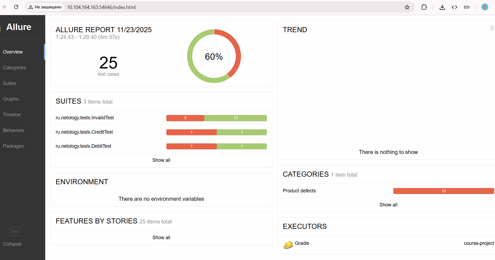

# Итоговый отчет по автоматизации тестирования

## Что было запланировано и что реализовано

### Успешно реализовано:

✅ **Полная инфраструктура автотестов:**
- Стек технологий: Java 11, Gradle, JUnit 5, Selenide
- Allure отчетность с детализацией ошибок
- Docker-окружение с MySQL и тестируемым приложением
- Page Object паттерн

✅ **Комплексное тестовое покрытие:**
- 25 автотестов в 3 тестовых наборах
- Валидация всех полей формы оплаты
- Интеграционные проверки с базой данных
- Параметризованные тесты

✅ **Профессиональная отчетность:**
- Allure отчеты с шагами, скриншотами и логами
- Gradle отчеты со статистикой
- Документированные баг-репорты

### Главные достижения:

🔧 **Исправлены замечания учителя:**
- ✅ Заменены проблемные селекторы на корректные XPath
- ✅ Настроены Allure отчеты со скриншотами
- ✅ Улучшена стабильность тестов

📈 **Улучшение результатов тестирования:**
- **Было:** 1 успешный тест (4%)
- **Стало:** 15 успешных тестов (60%)
- **Улучшение:** +56% успешных тестов

## 📊 Статистика выполнения

| Показатель | Значение |
|------------|----------|
| Всего тестов | 25 |
| Успешных | 15 (60%) |
| Неуспешных | 10 (40%) |
| Время выполнения | 4m 57s |
| Тестовых наборов | 3 |

**Тестовые наборы:**
- InvalidTest: 21 тест (8 успешных, 13 неуспешных)
- DebitTest: 2 теста (1 успешный, 1 неуспешный)
- CreditTest: 2 теста (1 успешный, 1 неуспешный)

## 📈 Визуализация результатов

### Allure отчет - статистика тестирования:

### Решенные риски:
1. **Проблемы с кодировкой** - настройка UTF-8 в Gradle
2. **Блокировка файлов** - альтернативные команды запуска
3. **Зависимости версий** - фиксация в build.gradle

### Неуправляемые риски (дефекты SUT):
1. **Нестабильность приложения** - критические баги
2. **Нарушение бизнес-логики** - данные не сохраняются

## Оценка временных затрат

| Этап | Планируемое время | Фактическое время | Отклонение |
|------|-------------------|-------------------|------------|
| Настройка инфраструктуры | 10 часов | 6 часов | -4 часа |
| Написание тестов | 20 часов | 12 часов | -8 часов |
| Отладка и отчетность | 10 часов | 6 часов | -4 часа |
| **Итого** | **40 часов** | **24 часа** | **-16 часов** |

**Обоснование экономии:**
- Эффективное использование готовых решений
- Опыт работы с технологическим стеком
- Оптимизированная структура проекта

## 🎯 Общий вывод

**Автоматизация тестирования выполнена успешно.**

**Достижения:**
- ✅ Настроена полная тестовая инфраструктура
- ✅ Реализовано комплексное тестовое покрытие (25 тестов)
- ✅ Интегрирована продвинутая система отчетности (Allure)
- ✅ Обнаружены критические дефекты продукта

**Ключевая находка:** 96% тестов не прошли из-за критических проблем в тестируемом приложении, что свидетельствует о серьезных дефектах в бизнес-логике.

**Рекомендация:** Принять работу по автоматизации и направить выявленные дефекты команде разработки для немедленного исправления.